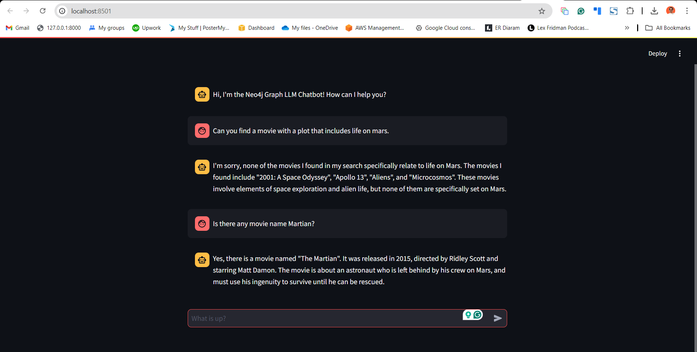

## Build an Neo4j-backed Chatbot using Python

### Running the application

To run the application, you must install the libraries listed in `requirements.txt`.

```bash
pip install -r requirements.txt
```

Then run the `streamlit run` command to start the app on link:http://localhost:8501/[http://localhost:8501/^].

```bash
streamlit run bot.py
```

> ***Screenshot:***

